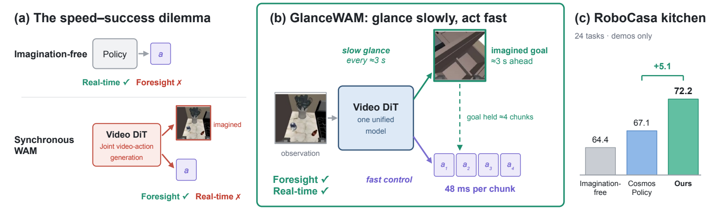

# GlanceWAM

**Sparse test-time imagination for video-world-model VLAs.**

[](https://arxiv.org/abs/2608.23927)
[](https://huggingface.co/datasets/LinhanWang/GlanceWAM)
[](LICENSE)



*(a)* Prior world-action models couple future generation to the action chunk at control rate,
paying multi-step sampling latency over a near-static horizon. *(b)* GlanceWAM decouples the two
timescales: it glances ahead asynchronously to imagine a single latent lookahead frame ≈3 s out on
a slow clock, while decoding action chunks in latent space every 48 ms. *(c)* On RoboCasa kitchen
(demos only) it reaches 72.2%, over synchronous Cosmos Policy at 67.1% and imagination-free
co-training at 64.4%.

Video generative models carry rich physical priors, but using them inside a robot policy forces a
trade-off: generating video at control rate is too slow, and dropping visual imagination costs task
success. GlanceWAM gets both by **decoupling imagination from control inside a single video DiT** —
an asynchronous proposer *glances ahead* on a slow clock to imagine one **lookahead frame** seconds
into the future, while the action head keeps decoding chunks at control rate, consuming that frame
directly in latent space without ever blocking on it.

Two pieces make it work, and both live in this repo: a **non-interfering attention mask** that keeps
the video representation from leaking into the action read-point, and **staleness-robust horizon
training** so the policy stays correct as the lookahead frame ages between refreshes.

| | RoboCasa kitchen (24 tasks) | LIBERO (4-in-1) |
|---|---|---|
| **GlanceWAM** | **0.721** | **0.989** |

Trained on demonstrations only.

The framework is `GlanceWAM` (`glancewam/model/framework/wam/GlanceWAM.py`): one forward pass
through the DiT yields both the features the action head reads and the velocity target for the
video loss, and the action head additionally cross-attends to a lookahead frame. In training that
frame is a hindsight frame drawn at `g ~ U(0, H_g]`; at inference the same DiT generates it.

Backbone: [SkyReels-V2 DF](https://huggingface.co/Skywork/SkyReels-V2-DF-1.3B-540P-Diffusers).
Action head: GR00T-style flow matching over 0.8 s chunks.

---

## 1. Data and checkpoints

Everything needed to reproduce the numbers above ships as one bundle on the Hub —
[**LinhanWang/GlanceWAM**](https://huggingface.co/datasets/LinhanWang/GlanceWAM) (21 GB):

```
glancewam_bundle/
  datasets/     LeRobot v3 datasets, UMT5 text caches already built
  checkpoints/  released checkpoints, one directory per run
```

| Checkpoint | Benchmark | Result |
|---|---|---|
| `glancewam_robocasa_kitchen` | RoboCasa kitchen, 24 tasks x 50 episodes | **0.721** |
| `glancewam_libero` | LIBERO 4-in-1, 4 suites x 500 episodes | **0.989** |

Kitchen run-to-run spread is ~0.02 — the environment is paired but the policy is unseeded — so
treat anything within ~±0.02 as a match.

The datasets are:

- LIBERO — `libero_{object,goal,spatial,10}_no_noops_1.0.0_lerobot`
- RoboCasa kitchen — `robocasa_<Task>_cosmos_lerobot`, one per task
  (rebuildable with `examples/Robocasa_kitchen/train_files/convert_cosmos_robocasa_to_lerobot.py`)

Mixtures are named in `examples/<bench>/train_files/data_registry/data_config.py`; the registry is
found by globbing `examples/*/train_files/data_registry/`, so a new benchmark needs no wiring.

### Download and wire it up

```bash
hf download LinhanWang/GlanceWAM --repo-type dataset --local-dir ./glancewam_bundle
```

That pulls all 21 GB. To take only what you need:

```bash
# LIBERO only — 5.0 GB
hf download LinhanWang/GlanceWAM --repo-type dataset --local-dir ./glancewam_bundle \
    --include "checkpoints/glancewam_libero/*" "datasets/libero_*"

# RoboCasa kitchen only — 16.2 GB
hf download LinhanWang/GlanceWAM --repo-type dataset --local-dir ./glancewam_bundle \
    --include "checkpoints/glancewam_robocasa_kitchen/*" "datasets/robocasa_cosmos_kitchen/*"

# checkpoints only, bring your own data — 6.3 GB
hf download LinhanWang/GlanceWAM --repo-type dataset --local-dir ./glancewam_bundle \
    --include "checkpoints/*"
```

Then point the repo at it — once. The launchers default to these two paths, so afterwards no
environment variables are needed:

```bash
mkdir -p results
ln -s "$PWD/glancewam_bundle/datasets"     results/Datasets
ln -s "$PWD/glancewam_bundle/checkpoints"  results/Checkpoints
```

`--local-dir` writes real files (not symlinks into the HF cache), which is what the two symlinks
above expect.

Or point `DATA_ROOT` elsewhere per run — it is the datasets root for both benchmarks, and the
kitchen scripts append `robocasa_cosmos_kitchen/` themselves.

### UMT5 text cache

Training defaults to `RESIDENT_TEXT_TABLE=True`, which serves frozen-UMT5 embeddings from a
GPU-resident per-prompt table instead of loading UMT5-XXL every step. **The bundle ships this cache
already built**, so there is nothing to do. If you bring your own data, build it first:

```bash
bash examples/LIBERO/train_files/run_precompute_umt5_skyreels.sh
bash examples/Robocasa_kitchen/train_files/run_precompute_umt5_skyreels.sh
```

It writes to `<dataset>/glancewam_cache/`. `RESIDENT_TEXT_TABLE=False` skips it and encodes live.

## 2. Environment setup

Two separate environments are involved. Training needs only the first; evaluation needs both.

### Policy environment (this repo)

Managed with [uv](https://docs.astral.sh/uv/), pinned to Python 3.11:

```bash
uv venv --python 3.11
source .venv/bin/activate
uv sync
uv pip install -e .
python tools/setup_ffmpeg6_shim.py
```

`tools/setup_ffmpeg6_shim.py` symlinks PyAV's wheel-bundled ffmpeg 6 shared objects into
`.venv/lib/ffmpeg6_shim/` so torchcodec can `dlopen` them — Ubuntu 22.04's stock ffmpeg 4.4 is too
old. The training launchers invoke it automatically if the shim directory is missing.

Attention runs through PyTorch SDPA; no user-space `flash-attn` install is needed on either Hopper
or Ampere.

### Simulator environment (evaluation only)

The simulators run a different Python version, so they cannot share the `.venv` above. Each is
installed as a **sibling directory** of this repo and talks to the policy server over a websocket,
which is why it needs no torch of its own:

```bash
bash examples/LIBERO/eval_files/install_libero.sh    # creates ../LIBERO
```

RoboCasa kitchen is set up by hand — see
[its eval README](examples/Robocasa_kitchen/eval_files/README.md) §0 (creates
`../robocasa-cosmos-policy`, plus a ~5 GB asset download).

### Verifying the installation

The framework file is self-contained and runs a fake-data forward + backward + predict pass on its
own — the fastest check that the policy environment is sound:

```bash
python glancewam/model/framework/wam/GlanceWAM.py
```

To exercise the data path too (needs the ffmpeg 6 shim on `LD_LIBRARY_PATH`, which the training
launchers set for you):

```bash
export LD_LIBRARY_PATH="$PWD/.venv/lib/ffmpeg6_shim:$PWD/.venv/lib/python3.11/site-packages/av.libs:$LD_LIBRARY_PATH"
python glancewam/dataloader/lerobot_datasets.py \
    --config_yaml examples/Robocasa_kitchen/train_files/config_glancewam_robocasa_kitchen.yaml
```

## 3. Training

Each launcher wraps `accelerate launch … glancewam/training/train.py` with the published recipe.
Reference hardware is 4xH200 (`CUDA_VISIBLE_DEVICES=0,1,2,3`); `NUM_PROCESSES` is derived from
`CUDA_VISIBLE_DEVICES`. Global batch is 128 = 4 GPUs x per-device 16 x grad-accum 2 — keep that
product fixed if you change the GPU count.

```bash
# LIBERO
bash examples/LIBERO/train_files/run_libero_glancewam.sh

# RoboCasa kitchen
bash examples/Robocasa_kitchen/train_files/run_robocasa_kitchen_glancewam.sh
```

Common overrides: `CUDA_VISIBLE_DEVICES`, `DATA_ROOT`, `DATA_MIX`, `BASE_WM`, `RUN_ID`,
`MAX_TRAIN_STEPS`, `PER_DEVICE_BATCH_SIZE`, `PRETRAINED_CHECKPOINT`, `IS_RESUME`.

Checkpoints land in `results/Checkpoints/<run_id>/checkpoints/`, with an EMA sibling (`*_ema.pt`)
alongside every step. Optimizer state is intentionally not saved.

Any config field can be overridden from the CLI with its dot-path, e.g.
`--framework.world_model.camera_concat side_by_side`.

## 4. Evaluation

Evaluation runs as two processes: the policy server in this repo's `.venv`, and a simulator client
in the sibling environment from §2. A sweep orchestrator drives both — it starts the server, fans
out sharded clients, tears down, and appends a row to `examples/<bench>/eval_summary.md`.

```bash
# LIBERO — 2000 episodes, one GPU, ~35 min -> expect 0.989
python tools/eval_libero_sweep.py \
    --ckpt results/Checkpoints/glancewam_libero/checkpoints/steps_15000_pytorch_model_ema.pt --gpu 0

# RoboCasa kitchen — 1200 episodes, 4 GPUs, ~45 min -> expect 0.721
python tools/eval_robocasa_kitchen_sweep.py \
    --ckpt results/Checkpoints/glancewam_robocasa_kitchen/checkpoints/steps_10000_pytorch_model_ema.pt \
    --gpus 0,1,2,3 --include-state
```

Each benchmark documents its own flags and gotchas — read these before the first run, since the
obs/action contracts differ and a mismatch degrades silently instead of erroring:

- **[LIBERO](examples/LIBERO/eval_files/README.md)** — stateless; horizon-weighted shard budget
- **[RoboCasa kitchen](examples/Robocasa_kitchen/eval_files/README.md)** — needs `--include-state`;
  `--gpus` is required in practice (one server OOMs on 24 tasks' clients)

## Acknowledgements

GlanceWAM is extracted from [StarVLA](https://github.com/JinhuiYE/starVLA) and reuses its
Lego-style framework/dataloader/trainer split. The action head follows NVIDIA
[GR00T N1.5](https://github.com/NVIDIA/Isaac-GR00T); the backbone is Skywork's SkyReels-V2 DF; the
RoboCasa kitchen task suite and data conversion follow NVIDIA's cosmos-policy release.

## License

MIT — see [LICENSE](LICENSE).
