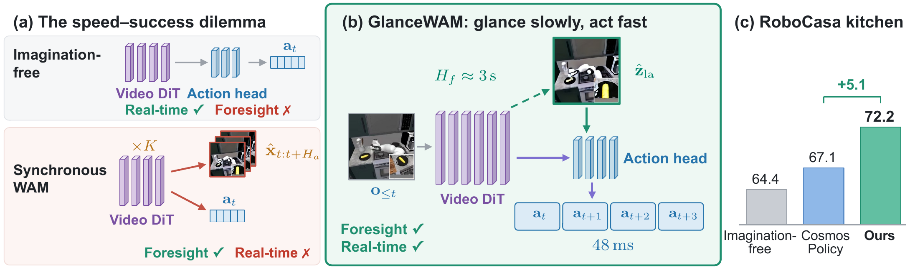

# GlanceWAM: Sparse Test-Time Imagination for World-Action Models

[](https://linhanwang.github.io/glancewam/)
[](https://arxiv.org/abs/2608.23927)
[](https://huggingface.co/datasets/LinhanWang/GlanceWAM)
[](LICENSE)



GlanceWAM decouples visual imagination from control inside one video DiT: it glances ahead on a slow
clock to imagine a single latent lookahead frame ≈3 s into the future, while the action head decodes
action chunks against it at control rate (48 ms per chunk), never blocking on generation. Trained on
demonstrations only, it reaches 72.2% on RoboCasa kitchen and 99.0% on LIBERO.
Real-robot videos are on the [project page](https://linhanwang.github.io/glancewam/).

Backbone: [SkyReels-V2 DF 1.3B](https://huggingface.co/Skywork/SkyReels-V2-DF-1.3B-540P-Diffusers).
Framework: [`glancewam/model/framework/wam/GlanceWAM.py`](glancewam/model/framework/wam/GlanceWAM.py).

## Installation

```bash
uv venv --python 3.11 && source .venv/bin/activate
uv sync && uv pip install -e .
python tools/setup_ffmpeg6_shim.py                 # ffmpeg 6 for torchcodec (Ubuntu 22.04 ships 4.4)
python glancewam/model/framework/wam/GlanceWAM.py  # sanity check: fake-data forward/backward/predict
```

Evaluation also needs a simulator, installed as a sibling directory (it talks to the policy server
over a websocket):

- **LIBERO** — `bash examples/LIBERO/eval_files/install_libero.sh` (creates `../LIBERO`)
- **RoboCasa kitchen** — see [its eval README](examples/Robocasa_kitchen/eval_files/README.md) §0

## Data and checkpoints

Datasets (LeRobot v3, UMT5 text cache included) and released checkpoints are one bundle on
[Hugging Face](https://huggingface.co/datasets/LinhanWang/GlanceWAM):

| Checkpoint | Benchmark | Success rate |
|---|---|---|
| `glancewam_robocasa_kitchen` | RoboCasa kitchen, 24 tasks × 50 episodes | 0.721 |
| `glancewam_libero` | LIBERO, 4 suites × 500 episodes | 0.989 |

```bash
# everything (21 GB)
hf download LinhanWang/GlanceWAM --repo-type dataset --local-dir ./glancewam_bundle

# or one benchmark: LIBERO (5.0 GB) / RoboCasa kitchen (16.2 GB)
hf download LinhanWang/GlanceWAM --repo-type dataset --local-dir ./glancewam_bundle \
    --include "checkpoints/glancewam_libero/*" "datasets/libero_*"
hf download LinhanWang/GlanceWAM --repo-type dataset --local-dir ./glancewam_bundle \
    --include "checkpoints/glancewam_robocasa_kitchen/*" "datasets/robocasa_cosmos_kitchen/*"

# link once; the launchers default to these paths
mkdir -p results
ln -s "$PWD/glancewam_bundle/datasets"    results/Datasets
ln -s "$PWD/glancewam_bundle/checkpoints" results/Checkpoints
```

Bringing your own data: build the UMT5 text cache first with
`examples/<bench>/train_files/run_precompute_umt5_skyreels.sh`.

## Training

Reference setup is 4×H200 with global batch 128 (4 GPUs × 16 per device × grad-accum 2); keep that
product fixed if you change the GPU count.

```bash
bash examples/LIBERO/train_files/run_libero_glancewam.sh
bash examples/Robocasa_kitchen/train_files/run_robocasa_kitchen_glancewam.sh
```

Common overrides (env vars): `CUDA_VISIBLE_DEVICES`, `DATA_ROOT`, `DATA_MIX`, `RUN_ID`,
`MAX_TRAIN_STEPS`, `PRETRAINED_CHECKPOINT`. Any config field can also be overridden by its dot-path,
e.g. `--framework.world_model.camera_concat side_by_side`. Checkpoints (with EMA) are written to
`results/Checkpoints/<run_id>/checkpoints/`.

## Evaluation

The sweep scripts start the policy server, run sharded simulator clients, and append results to
`examples/<bench>/eval_summary.md`.

```bash
# LIBERO: 2000 episodes, 1 GPU, ~35 min
python tools/eval_libero_sweep.py \
    --ckpt results/Checkpoints/glancewam_libero/checkpoints/steps_15000_pytorch_model_ema.pt --gpu 0

# RoboCasa kitchen: 1200 episodes, 4 GPUs, ~45 min
python tools/eval_robocasa_kitchen_sweep.py \
    --ckpt results/Checkpoints/glancewam_robocasa_kitchen/checkpoints/steps_10000_pytorch_model_ema.pt \
    --gpus 0,1,2,3 --include-state
```

Kitchen results vary by about ±0.02 between runs. Read the per-benchmark notes before the first run,
since a wrong observation/action setting degrades silently rather than erroring:
[LIBERO](examples/LIBERO/eval_files/README.md) ·
[RoboCasa kitchen](examples/Robocasa_kitchen/eval_files/README.md).

## Citation

```bibtex
@article{wang2026glancewam,
  title         = {GlanceWAM: Sparse Test-Time Imagination for World-Action Models},
  author        = {Wang, Linhan and An, Zijian and Zhang, Mingyuan and Dai, Chen and Xu, Yi and
                   Cui, Can and Wang, Jiayan and Yang, Zichong and Chen, Yinlin and Zhou, Lifeng and
                   Lu, Chang-Tien},
  journal       = {arXiv preprint arXiv:2608.23927},
  eprint        = {2608.23927},
  archivePrefix = {arXiv},
  url           = {https://arxiv.org/abs/2608.23927},
  year          = {2026}
}
```

## Acknowledgements

GlanceWAM is built on [StarVLA](https://github.com/JinhuiYE/starVLA). The action head follows
NVIDIA [GR00T N1.5](https://github.com/NVIDIA/Isaac-GR00T), the backbone is Skywork's SkyReels-V2 DF,
and the RoboCasa kitchen setup follows NVIDIA's cosmos-policy release.

## License

MIT, see [LICENSE](LICENSE).
